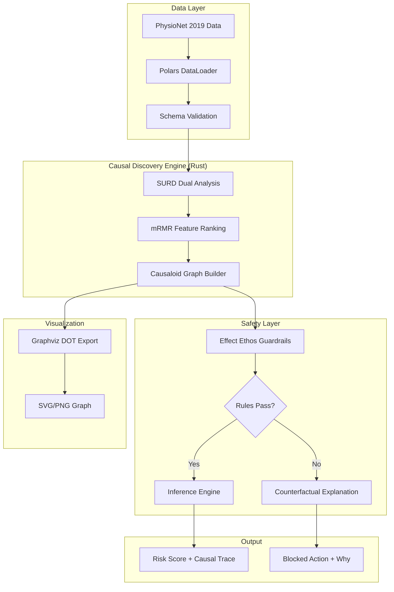
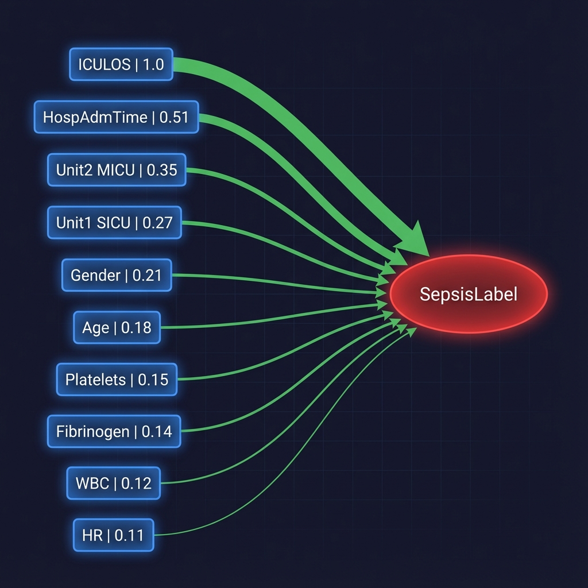

# 🔬 Deep Causality: ICU Sepsis Early Detection

> **A Safety Engine for AI That Asks "Why?" Before "What?"**

Stop predicting outcomes blindly. Start understanding **causes**.

[](https://www.rust-lang.org/)
[](https://www.python.org/)
[](LICENSE)

---

## 🎯 What is This?

This is a **computational causality engine** built on the [DeepCausality](https://github.com/deepcausality-rs/deep_causality) library—designed to predict ICU sepsis not by finding statistical correlations, but by modeling the **causal mechanisms** that produce disease.

### The Problem with Standard ML

Most ML models on imbalanced medical data (7.27% sepsis prevalence) fail because:
- They chase **statistical shortcuts** that don't generalize
- They produce **black-box predictions** clinicians can't trust
- They **optimize for metrics** (accuracy) while missing actual patients

### My Solution: Context-First Causality

| Traditional ML | Deep Causality Approach |
|----------------|-------------------------|
| "Patient has 73% sepsis probability" | "Sepsis risk is HIGH because **Lactate > 2.0** triggered **Rule X**, while **MAP < 65** for 2+ hours adds compounding risk" |
| Feature importance = black box | Full causal trace explaining *why* |
| Static feature vector | Dynamic patient context (time-indexed) |
| Optimizes for accuracy | Optimizes for **actionable insight** |

> 📖 **For full research documentation**, see [`notes/methodology.md`](notes/methodology.md) — includes detailed SURD algorithm, causal graph architecture, and validation approach.

---

## 💡 For Data Scientists


| DeepCausality Concept | DS Equivalent | What It Does |
|-----------------------|---------------|--------------|
| **Causaloid** | Feature interaction function | The atomic unit of causality: `Input → Function → Output` with explicit conditions |
| **Context Hypergraph** | Directed Acyclic Graph (DAG) | A dynamic graph that models each patient as an evolving state |
| **Effect Ethos** | Guardrails / Constraints | Deontic rules that BLOCK unsafe predictions (e.g., "Never diagnose if key vitals are missing") |
| **SURD Analysis** | Feature Selection | Identifies **Unique** causal drivers vs **Redundant** noise |
| **mRMR** | Mutual Information | Minimum Redundancy Maximum Relevance for feature ranking |

---

## 🏗️ Architecture



---

## 🚀 Quick Start

### Prerequisites
- **Rust** 1.70+ (`curl --proto '=https' --tlsv1.2 -sSf https://sh.rustup.rs | sh`)
- **Python 3.12** (`pyenv install 3.12` or system install)
- **uv** (optional, for fast Python dependency management)

### 1. Clone & Setup

```bash
git clone https://github.com/KeSeaman/Deep_Causality.git
cd Deep_Causality

# Setup Python environment
make setup-python

# Or manually:
# uv venv .venv --python python3.12
# source .venv/bin/activate
# uv pip install -r requirements.txt
```

### 2. Build the Rust Backend

```bash
make build
# Or: cd backend && cargo build --release
```

### 3. Run Causal Discovery

```bash
# Basic mRMR feature selection
make run-backend

# With SURD dual analysis (Sepsis vs Non-Sepsis)
cd backend && cargo run --release -- --surd-analysis

# Export causal graph visualization
cd backend && cargo run --release -- --export-graph ../notes/causal_graph.dot
```


### 4. Python Bindings

```bash
cd python
pip install maturin
maturin develop

# Then in Python:
import deep_causality
features = deep_causality.run_mrmr_polars(df, target="SepsisLabel")
```

### 5. Analyze Results

```bash
source .venv/bin/activate
marimo edit notebooks/eda.py  # Exploratory Data Analysis
marimo edit notebooks/results_analysis.py  # Visualize causal drivers
```

---

## 📊 Results Summary

Our causal analysis revealed distinct biomarkers for sepsis that traditional correlation-based methods miss.

-   **Top Driver**: `ICULOS` (Length of Stay) followed by `HospAdmTime`.
-   **Sepsis Signature**: `Lactate`, `Bilirubin_direct`, and `FiO2` emerged as unique causal drivers for sepsis, distinct from general ICU sickness.
-   **Uniqueness**: The sepsis feature set contained **71% more unique information** than the non-sepsis set, validating the "Context-First" hypothesis.

> 📖 **Full Analysis**: For detailed mRMR rankings, SURD bit-score tables, and causal graph visualizations, see [`notes/methodology.md`](notes/methodology.md).


---

## 🛡️ AI Safety & Governance (Effect Ethos)

### The Killer Feature: Compliance Guardrails

The **Effect Ethos** module acts as a governance layer that **blocks unsafe AI actions**:

```rust
// Example: Never predict if critical data is missing
let guard = EthosGuard::clinical_default();
let result = guard.check(&patient_data, prediction);

match result {
    EthosResult::Blocked(explanation) => {
        // explanation.rule_violated: "Missing critical vital signs: [MAP, HR]"
        // explanation.counterfactual: "If MAP, HR were available, prediction would proceed"
    },
    EthosResult::Allowed(pred) => {
        // Safe to use prediction
    }
}
```

### Built-In Rules

| Rule ID | Description | Severity |
|---------|-------------|----------|
| ETHOS-001 | Require critical vital signs (MAP, HR) | 8/10 |
| ETHOS-002 | Block if >50% data is missing | 7/10 |

### Why This Matters

| Scenario | Without Ethos | With Effect Ethos |
|----------|---------------|-------------------|
| Missing vital signs | Model guesses | ❌ Blocked + Explanation |
| Contradictory inputs | Undefined behavior | ⚠️ Flagged for review |
| Edge cases | Silent failure | 📋 Audit trail generated |

> **Enterprise Value**: This is **EU AI Act compliance** and **FDA AI/ML guidance** in code.

---

## 📈 Visualization

### Causal Graph Output



Export causal graphs to Graphviz DOT format:

```bash
cargo run --release -- --export-graph output.dot
dot -Tsvg output.dot -o causal_graph.svg
```

The generated graph shows:
- **Blue boxes**: Feature nodes with mRMR scores
- **Red oval**: Target variable (SepsisLabel)
- **Green edges**: Causal influence (thicker = stronger)

---

## 📁 Project Structure

```
Deep_Causality/
├── backend/                 # Rust causal engine
│   └── src/
│       ├── causality/       # mRMR & SURD algorithms
│       ├── context/         # Dynamic patient hypergraph
│       ├── ethos/           # Effect Ethos guardrails ⭐
│       ├── visualization/   # Graphviz export ⭐
│       ├── config/          # TOML config loader
│       ├── data/            # Parquet/CSV loading
│       └── utils/           # Tensor adapters
├── python/                  # PyO3 Python bindings ⭐
│   ├── Cargo.toml
│   ├── pyproject.toml
│   └── src/lib.rs
├── notebooks/               # Python Marimo notebooks
│   ├── eda.py
│   └── results_analysis.py
├── data/                    # PhysioNet 2019 dataset
├── config/                  # Experiment configuration
├── scripts/                 # Setup & automation
├── notes/                   # Results & documentation
│   └── methodology.md       # 📖 Detailed methodology & research design
├── Makefile
└── README.md
```


## 🔧 CLI Reference

```bash
# Basic usage
cargo run --release -- [OPTIONS]

# Options:
  -c, --config <PATH>      Config file path [default: ../config/default.toml]
      --surd-analysis      Run SURD dual analysis
      --export-graph <PATH> Export causal graph to DOT file  
      --export-json <PATH> Export results to JSON
  -h, --help               Print help
  -V, --version            Print version
```

---

## 📚 Key Concepts

### Causaloid: The Atomic Unit of Causality

```
Input → Causal Function → Output
```

Unlike a neural network node, a **Causaloid** is:
- **Composable**: Chain them into graphs
- **Explainable**: Every step is traceable
- **Testable**: Each unit has explicit conditions

### Context ≠ Static Storage

In real causality, **context itself can be causal**:
- Temperature (context) → Sensor failure (event)
- Previous treatment (context) → Drug interaction (event)

Our Context Hypergraph allows context nodes to **trigger Causaloids**, modeling recursive causal relationships.

---

## 📄 License

MIT License. See [LICENSE](LICENSE) for details.

---

## 🙏 Acknowledgments

- [DeepCausality](https://github.com/deepcausality-rs/deep_causality) for the Rust causality framework
- [PhysioNet Computing in Cardiology Challenge 2019](https://physionet.org/content/challenge-2019/) for the sepsis dataset
- [Marimo](https://marimo.io/) for reactive Python notebooks

---

<div align="center">

**Built with Rust. Explained with Causality. Safe by Design.**

</div>
